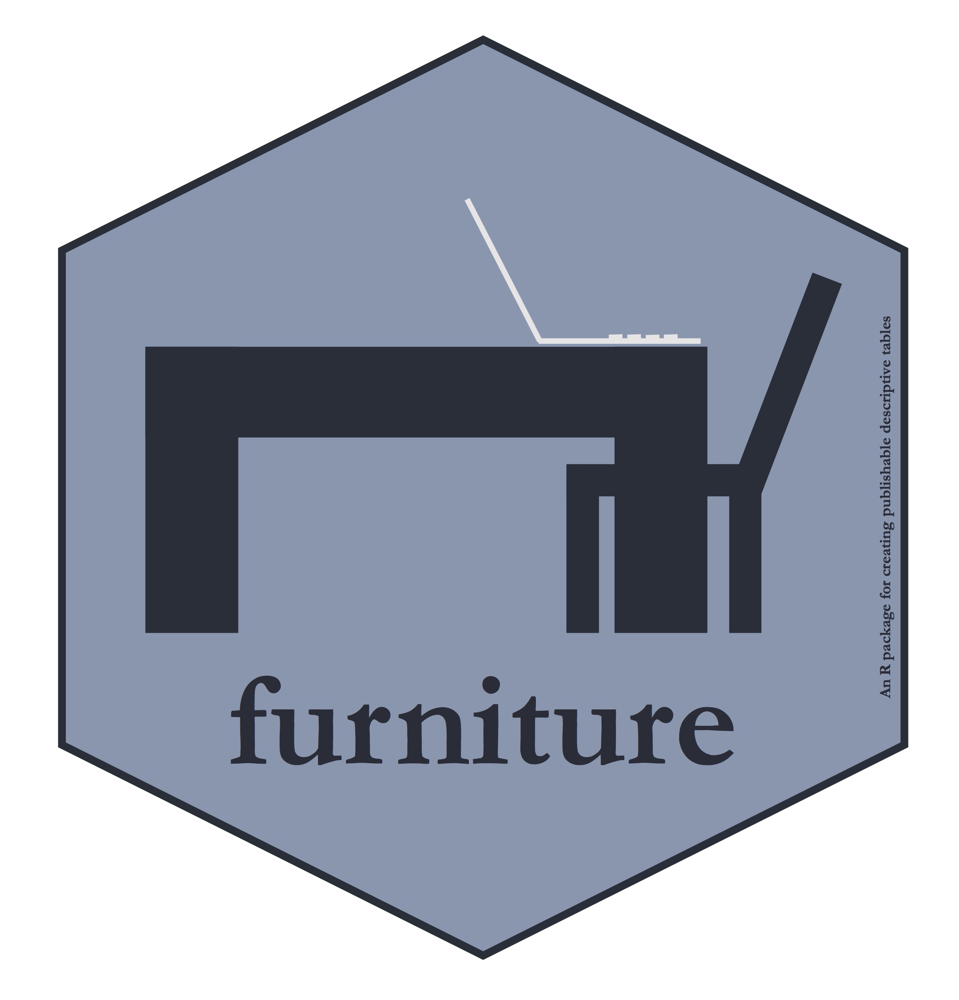

<!-- README.md is generated from README.Rmd. Please edit that file -->

```{r, echo = FALSE}
knitr::opts_chunk$set(
  collapse = TRUE,
  comment = "#>",
  fig.path = "README-"
)
```


# furniture: 1.7.2 

[](http://www.r-pkg.org/badges/version/furniture)
[](http://www.rdocumentation.org/packages/furniture)
[](http://cranlogs.r-pkg.org/badges/grand-total/furniture)
[](https://travis-ci.org/TysonStanley/furniture)
[](https://codecov.io/gh/tysonstanley/furniture)


The furniture R package contains functions to help with data cleaning/tidying (e.g., `washer`), exploratory data analysis and reporting (e.g., `table1`, `%xt%`). It currently contains six main functions:

1. `table1()` -- gives a well-formatted table for academic publication of descriptive statistics. Very useful for quick analyses as well. Notably, `table1()` now works with `dplyr::group_by()`.
2. `washer()` -- changes several values in a variable (very useful for changing place holder values to missing).
3. `long()` -- is a wrapper of `stats::reshape()`, takes the data from wide to long format (long is often the tidy version of the data), works well with the tidyverse, and can handle unbalanced multilevel data.
4. `wide()` -- also a wrapper of `stats::reshape()`, takes the data from long to wide, and like `long()`, works well with the tidyverse and can handle unbalanced multilevel data.
5. `tableC()` -- gives a well-formatted table of correlations.
6. `tableF()` -- provides a thorough frequency table for quick checks of the levels of a variable.

In conjunction with many other tidy tools, the package should be useful for health, behavioral, and social scientists working on quantitative research.

# Installation

The latest stable build of the package can be downloaded from CRAN via:

```{r, eval = FALSE}
install.packages("furniture")
```
You can download the developmental version via:

```{r, eval = FALSE}
library(devtools)
install_github("tysonstanley/furniture")
```

# Using furniture

The main functions are the `table_()` functions (e.g., `table1()`, `tableC()`, `tableF()`).

```{r}
library(furniture)
data("nhanes_2010")

table1(nhanes_2010,
       age, marijuana, illicit, rehab, asthma,
       splitby=~asthma)
```

```{r}
data("nhanes_2010")

table1(nhanes_2010,
       age, marijuana, illicit, rehab, asthma,
       splitby=~asthma, 
       output = "text2")
```

```{r}
tableC(nhanes_2010, 
       age, active, vig_active, 
       na.rm=TRUE)
```

```{r}
tableF(nhanes_2010, age)
```


## Notes

The package is most useful in conjunction with other tidy tools to get data cleaned/tidied and start exploratory data analysis. I recommend using packages such as `library(dplyr)`, `library(tidyr)`, and `library(ggplot2)` with `library(furniture)` to accomplish this.

The most important function--`table1`--is simply built for both exploratory descriptive analysis and communication of findings. See vignettes or [tysonstanley.github.io](https://tysonstanley.github.io/) for several examples of its use. Also see the pre-print of our paper in the [R Journal](https://journal.r-project.org/archive/2017/RJ-2017-037/RJ-2017-037.pdf).


