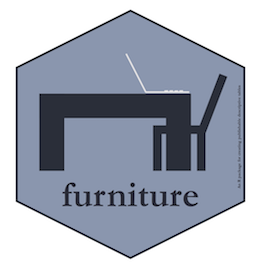

<!-- README.md is generated from README.Rmd. Please edit that file -->
furniture: 1.7.3 
==========================================================================

[](http://www.r-pkg.org/badges/version/furniture) [](http://www.rdocumentation.org/packages/furniture) [](http://cranlogs.r-pkg.org/badges/grand-total/furniture) [](https://travis-ci.org/TysonStanley/furniture) [](https://codecov.io/gh/tysonstanley/furniture)

The furniture R package contains functions to help with data cleaning/tidying (e.g., `washer`), exploratory data analysis and reporting (e.g., `table1`, `%xt%`). It currently contains eight main functions:

1.  `table1()` -- gives a well-formatted table for academic publication of descriptive statistics. Very useful for quick analyses as well. Notably, `table1()` now works with `dplyr::group_by()`.
2.  `washer()` -- changes several values in a variable (very useful for changing place holder values to missing).
3.  `long()` -- is a wrapper of `stats::reshape()`, takes the data from wide to long format (long is often the tidy version of the data), works well with the tidyverse, and can handle unbalanced multilevel data.
4.  `wide()` -- also a wrapper of `stats::reshape()`, takes the data from long to wide, and like `long()`, works well with the tidyverse and can handle unbalanced multilevel data.
5.  `tableC()` -- gives a well-formatted table of correlations.
6.  `tableF()` -- provides a thorough frequency table for quick checks of the levels of a variable.
7.  `rowmeans()` -- a tidyverse friendly version of `rowMeans()`
8.  `rowsums()` -- a tidyverse friendly version of `rowSums()`

In conjunction with many other tidy tools, the package should be useful for health, behavioral, and social scientists working on quantitative research.

Installation
============

The latest stable build of the package can be downloaded from CRAN via:

``` r
install.packages("furniture")
```

You can download the developmental version via:

``` r
library(devtools)
install_github("tysonstanley/furniture")
```

Using furniture
===============

The main functions are the `table_()` functions (e.g., `table1()`, `tableC()`, `tableF()`).

``` r
library(furniture)
#> furniture 1.7.3: learn more at tysonbarrett.com
data("nhanes_2010")

table1(nhanes_2010,
       age, marijuana, illicit, rehab,
       splitby=~asthma)
#> 
#> ───────────────────────────────────
#>                   asthma 
#>            Yes         No         
#>             n = 251    n = 1164   
#>  age                              
#>            23.0 (3.9)  23.4 (4.0) 
#>  marijuana                        
#>     Yes    131 (57.5%) 584 (57.4%)
#>     No     97 (42.5%)  434 (42.6%)
#>  illicit                          
#>     Yes    23 (10.1%)  117 (11.5%)
#>     No     205 (89.9%) 901 (88.5%)
#>  rehab                            
#>     Yes    10 (7.6%)   37 (6.3%)  
#>     No     121 (92.4%) 547 (93.7%)
#> ───────────────────────────────────
```

``` r
table1(nhanes_2010,
       age, marijuana, illicit, rehab,
       splitby=~asthma, 
       output = "text2")
#> 
#> ───────────────────────────────────
#>                   asthma 
#>            Yes         No         
#>             n = 251    n = 1164   
#>  --------- ----------- -----------
#>  age                              
#>            23.0 (3.9)  23.4 (4.0) 
#>  marijuana                        
#>     Yes    131 (57.5%) 584 (57.4%)
#>     No     97 (42.5%)  434 (42.6%)
#>  illicit                          
#>     Yes    23 (10.1%)  117 (11.5%)
#>     No     205 (89.9%) 901 (88.5%)
#>  rehab                            
#>     Yes    10 (7.6%)   37 (6.3%)  
#>     No     121 (92.4%) 547 (93.7%)
#> ───────────────────────────────────
```

``` r
library(tidyverse)
nhanes_2010 %>%
  group_by(asthma) %>%
  table1(age, marijuana, illicit, rehab,
         output = "text2")
#> 
#> ───────────────────────────────────
#>                   asthma 
#>            Yes         No         
#>             n = 251    n = 1164   
#>  --------- ----------- -----------
#>  age                              
#>            23.0 (3.9)  23.4 (4.0) 
#>  marijuana                        
#>     Yes    131 (57.5%) 584 (57.4%)
#>     No     97 (42.5%)  434 (42.6%)
#>  illicit                          
#>     Yes    23 (10.1%)  117 (11.5%)
#>     No     205 (89.9%) 901 (88.5%)
#>  rehab                            
#>     Yes    10 (7.6%)   37 (6.3%)  
#>     No     121 (92.4%) 547 (93.7%)
#> ───────────────────────────────────
```

``` r
tableC(nhanes_2010, 
       age, active, vig_active, 
       na.rm=TRUE)
#> N = 317
#> Note: pearson correlation (p-value).
#> 
#> ──────────────────────────────────────────────────
#>                [1]            [2]           [3]  
#>  [1]age        1.00                              
#>  [2]active     -0.148 (0.008) 1.00               
#>  [3]vig_active -0.083 (0.141) 0.828 (<.001) 1.00 
#> ──────────────────────────────────────────────────
```

``` r
tableF(nhanes_2010, age)
#> 
#> ──────────────────────────────────
#>  age Freq CumFreq Percent CumPerc
#>  18  191  191     13.48%  13.48% 
#>  19  153  344     10.80%  24.28% 
#>  20  111  455     7.83%   32.11% 
#>  21  95   550     6.70%   38.81% 
#>  22  100  650     7.06%   45.87% 
#>  23  112  762     7.90%   53.78% 
#>  24  93   855     6.56%   60.34% 
#>  25  100  955     7.06%   67.40% 
#>  26  91   1046    6.42%   73.82% 
#>  27  77   1123    5.43%   79.25% 
#>  28  91   1214    6.42%   85.67% 
#>  29  86   1300    6.07%   91.74% 
#>  30  117  1417    8.26%   100.00%
#> ──────────────────────────────────
```

In addition, the `rowmeans()` and `rowsums()` functions offer a simplified use of `rowMeans()` and `rowSums()`, particularly when using the tidyverse's `mutate()`.

``` r
nhanes_2010 %>%
  select(vig_active, mod_active) %>%
  mutate(avg_active = rowmeans(vig_active, mod_active, na.rm=TRUE)) %>%
  mutate(sum_active = rowsums(vig_active, mod_active, na.rm=TRUE))
#> # A tibble: 1,417 x 4
#>    vig_active mod_active avg_active sum_active
#>         <dbl>      <dbl>      <dbl>      <dbl>
#>  1       30.0       NA         30.0       30.0
#>  2      180        180        180        360  
#>  3       NA         NA        NaN          0  
#>  4       20.0       70.0       45.0       90.0
#>  5      120         NA        120        120  
#>  6       NA         NA        NaN          0  
#>  7       NA        120        120        120  
#>  8      120         NA        120        120  
#>  9       NA         NA        NaN          0  
#> 10       NA         NA        NaN          0  
#> # ... with 1,407 more rows
```

Notes
-----

The package is most useful in conjunction with other tidy tools to get data cleaned/tidied and start exploratory data analysis. I recommend using packages such as `library(dplyr)`, `library(tidyr)`, and `library(ggplot2)` with `library(furniture)` to accomplish this.

The most important function--`table1`--is simply built for both exploratory descriptive analysis and communication of findings. See vignettes or [tysonstanley.github.io](https://tysonstanley.github.io/) for several examples of its use. Also see the pre-print of our paper in the [R Journal](https://journal.r-project.org/archive/2017/RJ-2017-037/RJ-2017-037.pdf).
